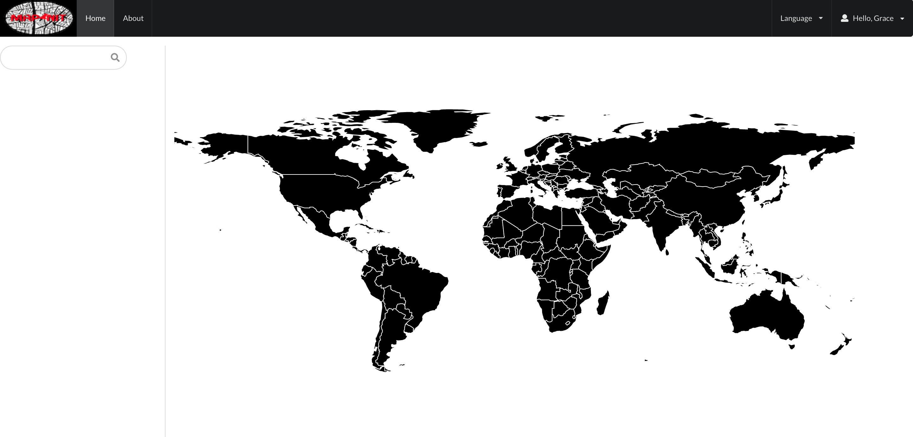

# MAPINIT
# Description

This project is made for bucket listing and trip planning. It is made for travelers where they can put a pin on the places that they've been to and look up at some places that they can go to in there future trip. In this app, users are able to login, sign up and logout also they can leave some comments or recommendations about the places that they've been to, upload pictures and like the post of each of the users that they think is good.

Deployed app can be access [here]().
# Table Of Contents
  * [Description](#description)
  * [Installation](#installation)
  * [Usage](#usage)
  * [License](#license)
  * [Contributing](#contributing)
  * [Tests](#tests)
  * [Questions](#questions)
# Installation
npm install
npm i axios
npm i sequelize
# Usage
npm start
# Licence 
MIT
# Contributors
grace
# Test 

# Questions 
 
For more information you can check my Github account Gracee19(https://github.com/Gracee19). 
Please don't hesitate to ask questions you can email me at .
